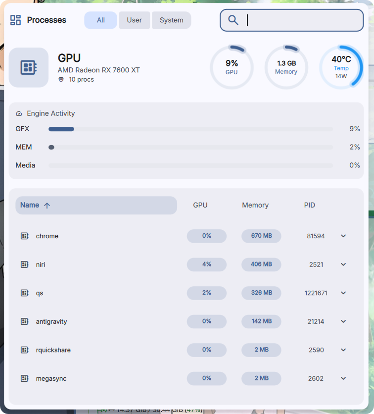
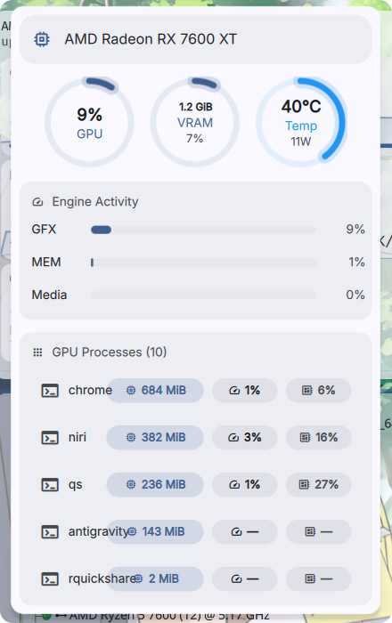
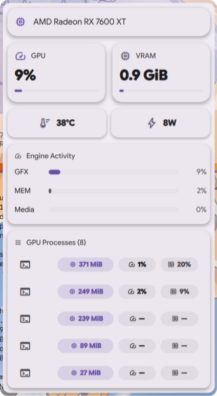
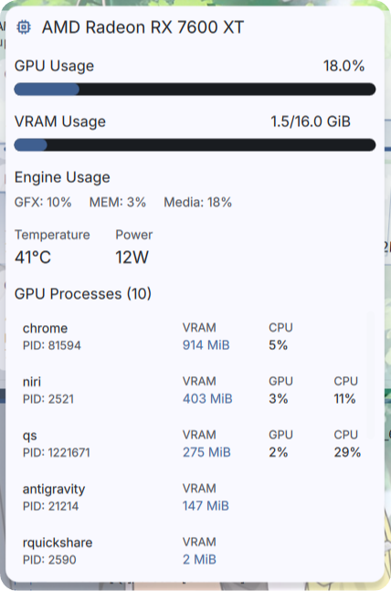
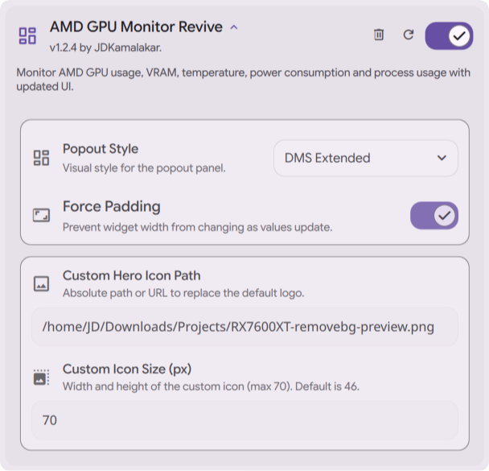

#  AMD GPU Monitor

[](https://github.com/Dank-Material-Shell)
[](https://www.kernel.org/doc/html/latest/gpu/amdgpu.html)
[](https://github.com/Umio-Yasuno/amdgpu_top)
[](https://github.com/JDKamalakar/DMS-AMD_GPU_Monitor_Revive/graphs/commit-activity)

A high-performance real-time monitoring suite for AMD GPUs, specifically engineered for the **Dank Material Shell** (DMS) environment. Track utilization, VRAM, thermals, and per-process metrics with native material styling.

> [!TIP]
> This plugin supports multiple display modes including **Legacy**, **Alternate**, **DMS Standard**, and **DMS Extended** to fit any desktop workflow.

---

## ✨ Features

* **📊 Comprehensive Monitoring:** Real-time GFX, Memory, and Media Engine usage.
* **🌡️ Thermal & Power:** Live tracking of edge/junction temperatures and socket power draw.
* **💾 VRAM Insights:** Detailed capacity display and allocation statistics.
* **🔍 Per-Process Metrics:** Identify which applications are consuming VRAM, GFX, and CPU cycles.
* **🚨 Smart Indicators:** Color-coded warnings (Normal/Warning/Critical) based on configurable thresholds.

---

## 📸 Interface Variations

The monitor adapts to your preferred layout with four distinct UI implementations:

| UI Mode | Description | Status |
| :--- | :--- | :--- |
| **DMS Extended** | Maximum data density with full process lists and charts. |  |
| **DMS Standard** | The native material look—balanced and clean. |  |
| **Alternate** | A modern, high-contrast take on the monitoring panel. |  |
| **Legacy** | Same UI As OG dms-amg-gpu-monitor. |  |

---
### ⚙️ Configuration
| Settings UI |
| :--- |
|  |

---

## 🛠️ Installation

### 📋 1. Prerequisites
Ensure you have the following installed on your system before proceeding:
* **Driver:** AMDGPU (Standard Linux Kernel driver)
* **Shell:** QuickShell & DankMaterialShell
* **Backend:** `amdgpu_top`

```bash
# Install backend (Arch Linux example)
yay -S amdgpu_top
```

### 🚀 2. Plugin Installation

#### 🚀 Recommended: DMS Plugin Manager
The easiest way to install and stay updated:
1. Open your **DMS Settings**.
2. Navigate to the **Plugin Manager** tab.
3. Search for `DMS-AMD_GPU_Monitor_Revive` and click **Install**.
4. Alternatively, browse the [Dank Linux Plugin Gallery](https://danklinux.com/plugins#/).

#### 🛠️ Manual Installation
For developers or users who want the latest edge builds:
1. Clone this repository into your DMS extensions/plugins folder:
   ```bash
   git clone [https://github.com/JDKamalakar/DMS-AMD_GPU_Monitor_Revive.git](https://github.com/JDKamalakar/DMS-AMD_GPU_Monitor_Revive.git)

---

### 🐛 Feedback & Contributions

Found a bug or have a feature request? Let’s make this better together.

* **Report Issues:** [GitHub Issues](https://github.com/JDKamalakar/DMS-AMD_GPU_Monitor_Revive/issues/new/choose)
* **Contributions:** Pull requests are welcome! Please ensure your code follows the shell's design guidelines.

---

## 📜 License

Part of DankMaterialShell. Check the main repository for license information.

## 🤝 Credits

Built for [DankMaterialShell](https://github.com/DankMaterialShell) • Uses [amdgpu_top](https://github.com/Umio-Yasuno/amdgpu_top)
